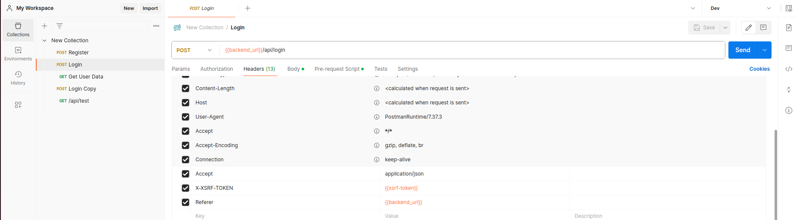

# Backend Setup Guide

Dieser Guide geht schrittweise durch die Installation und Konfiguration des Backends mit Laravel und MySQL.

Das Ziel ist es, eine lokale Entwicklungsumgebung aufzusetzen, die es ermöglicht, die Backend-Logik zu entwickeln und zu testen.

## Voraussetzungen

-   Docker, Docker Compose (https://docs.docker.com/get-docker/)
-   Composer sollte über den Terminal verfügbar sein (https://getcomposer.org/download/). Kann auch über Docker installiert werden, aber es empfiehlt sich eine lokale Installation für die Entwicklung zu haben.
-   Empfehlenswert: PHP 8.0 oder höher (https://www.php.net/downloads)
-   Empfehlenswert: Postman (https://www.postman.com/downloads/)

# Installation

Für ein besseres zusammenarbeiten installieren wir Laravel in einem Docker Container. Für Laravel gibt es ein offizielles Erweiterungspaket namens Sail, das die Installation und Verwaltung von Laravel in einem Docker-Container vereinfacht. Sail kann auch nachträglich installiert werden, aber es ist einfacher, es direkt bei der Installation zu verwenden. Es installiert Laravel mit MySQL und Redis und konfiguriert alles für die Verwendung mit Docker.

Dokumentation: https://laravel.com/docs/11.x/sail

## 1. Laravel mit Docker (Sail) installieren

Nur nötig, wenn Docker Desktop verwendet wird:

```bash
# Hiermit wird der Docker Desktop auf die lokale Entwicklungsumgebung eingestellt
docker context use default
```

Wir verwenden den CURL-Befehl für Linux, um Sail zu installieren. Führe den folgenden Befehl im Terminal aus:

```bash
# Ersetze example-app durch den Namen deines Projekts, z.B. mini-twitter. Dieser Name wird auch für den Docker-Container verwendet und ein Ordner mit diesem Namen wird erstellt.
curl -s https://laravel.build/example-app | bash
```

Wechsle in das Projektverzeichnis:

```bash
# ersetze example-app durch den Namen deines Projekts (z.B. mini-twitter)
cd example-app
```

Wir möchten noch phpMyAdmin hinzufügen, um die Datenbank zu verwalten. Füge die folgende Zeile in die Datei docker-compose.yml ein. Achte darauf, dass die Einrückung (Tab) korrekt ist. Füge die Zeile unterhalb von MySQL hinzu:

```yaml
phpmyadmin:
    image: phpmyadmin/phpmyadmin
    ports:
        - 8080:80
    links:
        - mysql
    environment:
        PMA_HOST: mysql
        PMA_PORT: 3306
    depends_on:
        mysql:
            condition: service_healthy
    networks:
        - sail
```

## 2. Docker Container starten

### Befehl Sail alias erstellen

Überspringe diesen Schritt, wenn du den Alias bereits erstellt hast.

Wir können nun Laravel mit Docker starten, anstatt "docker compose up" zu verwenden, verwenden wir "./vendor/bin/sail up". Dieser Befehl startet die Docker-Container und bindet die Ports für die Verwendung in der lokalen Entwicklungsumgebung. Damit wir nicht dauernd den ganzen Pfad eingeben müssen, können wir einmalig ein Alias erstellen. Öffne die Datei ~/.bashrc oder ~/.bash_aliases und füge folgende Zeile hinzu:

```bash
alias sail='bash vendor/bin/sail'
```

Führe den Befehl aus, um die Änderungen zu übernehmen:

```bash
source ~/.bashrc
```

### Befehl sail up ausführen

Jetzt können wir Sail verwenden, um die Docker-Container zu starten:

```bash
# Dieser Befehl startet "docker compose up" und bindet die Ports für die Verwendung in der lokalen Entwicklungsumgebung
sail up
```

Jetzt sollte unter http://localhost:80 die Laravel-Startseite erscheinen. Unter http://localhost:8080 kann phpMyAdmin aufgerufen werden. Womöglich ist eine Error-Seite unter http://localhost:80 zu sehen.

### Permissions Problem

Bei Linux könnte es sein, dass die Berechtigungen für die Dateien nicht korrekt sind. Das könnte an Docker Desktop für Linux liegen. Lese die Error-Meldung, siehst du im Pfad "/var/www/html/storage/..." und den Fehler "Permission denied", dann sind die Berechtigungen nicht korrekt. Um die Berechtigungen zu korrigieren, führe den folgenden Befehl aus:

```bash
sudo chmod -R 777 storage
```

Öffne den Browser nochmals und lade die Seite neu. Die Error-Seite sollte verschwinden und eine neue Meldung erscheinen, dass die Datenbank nicht gefunden wurde. Das ist in Ordnung, da wir noch keine Datenbank erstellt haben, bzw. die Datenbank Konfigurationen noch nicht migriert wurden.sailt Ports können auftreten, wenn die Ports bereits von anderen Anwendungen verwendet werden. In diesem Fall diese Applikationen beenden und die Ports wieder freigeben.

Schaue die Error-Meldungen an und versuche die Ports herauszufinden, die bereits verwendet werden. Mit dem Befehl lsof können wir laufende Prozesse und die Ports herausfinden, die sie verwenden:

```bash
sudo netstat -tulpen | grep :<PORT>
```

Finde den Prozess, der den Port verwendet übertrage die PID in den foglenden Befehl, um den Prozess zu stoppen. Die PID befindet sich in der letzten Spalte, die Nummer vor dem Namen des Prozesses.

```bash
sudo kill <PID>
```

## 3. Laravel Konfiguration

Wir möchten Laravel als API nutzen. Um den Prozess zu beschleunigen, können wir verschiedene Pakete installieren, die uns die Arbeit erleichtern. Wir installieren Sanctum und Fortify, um die Authentifizierung zu vereinfachen.

### Sanctum

Sanctum ist ein einfaches Paket zur Authentifizierung von APIs. Es verwendet Tokens, um Benutzer zu authentifizieren. Dokumentation: https://laravel.com/docs/11.x/sanctum

```bash
# Installiere Sanctum
composer require laravel/sanctum
```

Die Konfigurationsdateien müssen wir noch sozuagen "veröffentlichen". Das bedeutet, dass die Dateien in das Projekt kopiert werden, damit wir sie bearbeiten können.

```bash
# Veröffentliche die Sanctum-Konfigurationsdatei
php artisan vendor:publish --provider="Laravel\Sanctum\SanctumServiceProvider"
```

#### Sanctum Konfiguration

Mit Sanctum können wir uns entscheiden, ob wir Cookies oder Tokens verwenden möchten. Für dieses Projekt verwenden wir die Session-Cookies, um die Authentifizierung zu vereinfachen.

1. Füge folgende Zeilen in deine .env-Datei hinzu, es sollte schon ein Berreich `SESSION_` vorhanden sein:

```bash
# for sanctum to work with localhost or your custom domain
SESSION_DOMAIN=localhost
SESSION_SECURE_COOKIE=true
SANCTUM_STATEFUL_DOMAINS="localhost"
```

2. Wir leeren den Cache, um die neuen Konfigurationen zu laden:

```bash
sail artisan config:clear
```

3. Jetzt werden die Cors-Konfigurationen angepasst. Zuerst müssen wir die Cors-Konfigurationen für uns Entwickler veröffentlichen:

```bash
# Veröffentliche die Cors-Konfigurationsdatei
php artisan config:publish cors
```

4. Öffne die Datei `config/cors.php` und prüfe die folgende Zeile "paths":

```php
# lässt Anfragen von der API zu und die CSRF-Cookie-Route
'paths' => ['api/*', 'sanctum/csrf-cookie'],
```

Weitere Infos zu Cors Laravel: https://laravel.com/docs/11.x/sanctum#spa-configuration
Was sind Cors: https://developer.mozilla.org/en-US/docs/Web/HTTP/CORS

5. Jetzt müssen wir noch die Middleware für Sanctum konfigurieren. Öffne die Datei `bootstrap/app.php` und füge die Middleware `withMiddleware Funktion folgendes` hinzu:

```php
use Illuminate\Foundation\Application;
use Illuminate\Foundation\Configuration\Exceptions;
use Illuminate\Foundation\Configuration\Middleware;

return Application::configure(basePath: dirname(__DIR__))
    ->withRouting(
        web: __DIR__ . '/../routes/web.php',
        api: __DIR__ . '/../routes/api.php',
        commands: __DIR__ . '/../routes/console.php',
        health: '/up',
    )
    ->withMiddleware(function (Middleware $middleware) {
        /*
            for session cookie authentication we need to add this here.
            src: https://laravel.com/docs/11.x/middleware#manually-managing-laravels-default-middleware-groups
        */
        $middleware->group('api', [
            \Laravel\Sanctum\Http\Middleware\EnsureFrontendRequestsAreStateful::class,
            // 'throttle:api',
            // \Illuminate\Routing\Middleware\SubstituteBindings::class,
        ]);
    })
    ->withExceptions(function (Exceptions $exceptions) {
        //
    })->create();

```

### Fortify

Fortify ist ein Paket, das die Authentifizierung von Benutzern vereinfacht. Es bietet verschiedene Funktionen, um die Authentifizierung zu konfigurieren. Dokumentation: https://laravel.com/docs/11.x/fortify

```bash
# Installiere Fortify
composer require laravel/fortify
```

Installiere den Fortify Service Provider:

```bash
php artisan fortify:install
```

#### Fortify Konfiguration

1. Fortify config anpassen, geht in die Datei `config/fortify.php` und passe folgende Zeilen an:

```php
// find an change prefix to /api
'prefix' => '/api',

// find and change views to false
'views' => false,
```

Jetzt sind haben die Fortify routes den Prefix `/api` und die Balde-Views sind deaktiviert, um nur die API zu verwenden. Wir können nähmlich Fortify für die Blade-Views verwenden, aber in diesem Projekt verwenden wir nur die API.

### Migrations

Unter `database/migrations` befinden sich die Migrations-Dateien, die die Tabellen für die Datenbank erstellen oder ändern. Damit die Konfigurationen in die Datenbank migriert werden, führe den folgenden Befehl aus:

```bash
sail artisan migrate
```

Wir müssen es mit Sail ausführen, weil wir Docker verwenden. Der Befehl `php artisan migrate` funktioniert nur, wenn wir Laravel lokal installiert haben.

Prüfe nun auf http://localhost, ob die Laravel-Startseite erscheint. Wenn ja, dann ist Laravel erfolgreich installiert und konfiguriert.

## API routes bearbeiten

Laravel 11 wird im Standard Konfiguration klein gehalten, gewisse Funktionen und Datein müssen wir selber aktivieren/hinzufügen. Um die API route Datei zu aktivieren, schreibe folgenden command in die Konsole:

```bash
php artisan install:api
```

Die Datei `routes/api.php` wird erstellt und die API-Route wird aktiviert. Die Datei `routes/web.php` ist wird nur für Blade-Views verwendet und wird nicht benötigt.

### API routes Konfiguration importieren

Füge folgende Zeile in die Datei `bootstrap/app.php` bei `withRouting` ein:

```php
    ->withRouting(
        web: __DIR__ . '/../routes/web.php',
        api: __DIR__ . '/../routes/api.php', // to enable api routes
        commands: __DIR__ . '/../routes/console.php',
        health: '/up',
    )
```

### Test API-Route erstellen

Für das Testen der API-Route erstellen wir eine einfache Route, die eine JSON-Antwort zurückgibt. Füge folgende Zeilen in die Datei `routes/api.php` ein:

```php
use Illuminate\Http\Request;
use Illuminate\Support\Facades\Route;

// TODO: remove this on public release, only for testing!
Route::get('/test', function () {
    return response()->json(['message' => 'Hello World!'], 200);
});
```

## Laravel Command um alle Routes zu sehen

Wir können die Laravel Command Line verwenden, um alle Routes zu sehen. Führe den folgenden Befehl aus:

```bash
sail artisan route:list
```

Die /api/test Route sollte in der Liste erscheinen.

## Postman für das Testen der API einrichten

Wir erstellen in Postman eine Collection, um die API-Route zu testen. Die Collection enthält die API-Route, die wir erstellt haben. Die Collection kann exportiert und geteilt werden, um anderen Entwicklern zu helfen, die API zu testen.

1. Öffne Postman und erstelle eine neue Collection.
2. Füge eine neue Request hinzu und gib der Request einen Namen.
3. Wähle die Methode GET aus und füge die URL `http://localhost/api/test` hinzu.
4. Führe die Request aus und prüfe, ob die Antwort `{"message":"Hello World!"}` ist.

Super! Deine API-Route funktioniert und du kannst nun mit der Entwicklung beginnen.

### Postman Registrierung und Login erstellen

Fortify nimmt uns die Arbeit ab, die Authentifizierung zu konfigurieren. Wir verwenden die bereits vorhandenen Fortify routes `/api/register` und `/api/login` für die Registrierung und das Login.

#### CSRF-Token

Laravel verwendet CSRF-Token, um Cross-Site Request Forgery (CSRF) zu verhindern. Wir müssen den CSRF-Token in Postman bzw. in unserer Applikation speichern und bei jeder Anfrage mitsenden die in den Routes mit Sanctum geschützt sind.

1. Erstelle eine neue Enviroment Variable in Postman für deine backend_url: `http://localhost`.
2. Erstelle eine neue Environment Variable in Postman und füge `xsrf-token` hinzu.
3. Speichere die Environment Variable.
4. Setze die neue Enviroment Config für die Collection.
   

5. Füge folgendes bei deinem Postman Request unter Pre-request Script hinzu:

```javascript
pm.sendRequest(
    {
        url: `${pm.environment.get("backend_url")}/sanctum/csrf-cookie`,
        method: "GET",
    },
    function (error, response, { cookies }) {
        if (!error) {
            pm.environment.set("xsrf-token", cookies.get("XSRF-TOKEN"));
        }
    }
);
```

6. Wichtig, bei jedem Request der Sanctum benötigt, muss der CSRF-Token mitgesendet werden. Füge folgendes unter Headers hinzu:

```
X-XSRF-TOKEN: {{xsrf-token}}
```

7. Zusätzlich mit dieser Architektur in Laravel müssen wir noch den Referer Header hinzufügen.

```
Referer: {{backend_url}}
```



Wichtig, ohne Doppelpunkte übernehmen!

#### Registrierung

1. Erstelle eine neue Request in Postman und füge die URL `{{backend_url}}/api/register` hinzu (die Environment Variable wird automatisch in den gescheiften Klammern ersetzt).
2. Wähle die Methode POST aus und füge die Body-Parameter `name`, `email`, `password` und `password_confirmation` hinzu.
3. Im untermenü Headers füge `Accept` und `application/json` hinzu. Damit wir JSON-Daten als Antwort erhalten.
4. Schaue auch, dass der CSRF-Token mitgesendet wird.
5. Senden den Request ab und prüfe, was die Antwort ist. Sollte einfach aktuell ein 201 Created sein.

Prüfe in der Datenbank, ob der Benutzer erstellt wurde.
Geh in phpMyAdmin `http://localhost:8080` und prüfe die Datenbank `laravel` und die Tabelle `users`. Der Benutzer sollte erstellt worden sein.

#### Login

1. Erstelle eine neue Request in Postman und füge die URL `{{backend_url}}/api/login` hinzu.
2. Wähle die Methode POST aus und füge die Body-Parameter `email` und `password` hinzu.
3. Im untermenü Headers füge `Accept` und `application/json` hinzu. Damit wir JSON-Daten als Antwort erhalten.
4. Schaue auch, dass der CSRF-Token mitgesendet wird.
5. Senden den Request ab und prüfe, was die Antwort ist. Sollte einfach aktuell ein 200 OK sein.

## Vue Setup

[Setup Guide Vue.js Frontend](/wiki/02-Setup-Guide-Laravel-Vue-Frontend.md)
